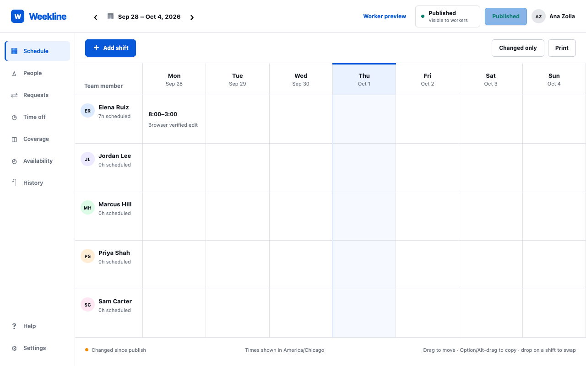
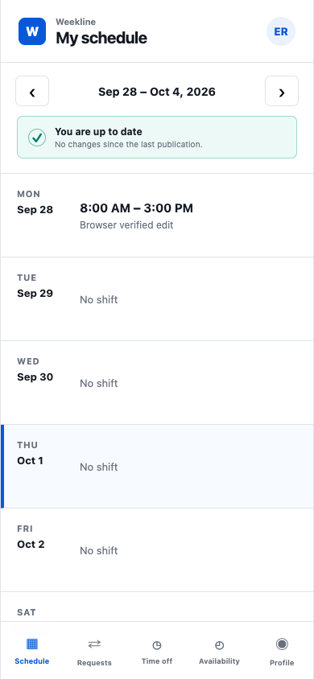

# Weekline — employee scheduling

A scheduling application for teams moving beyond weekly spreadsheets and printed rosters. Managers build and publish schedules in a desktop-oriented weekly grid; workers use a mobile view to see their shifts and coworkers. Angular provides the interface, a Go API handles requests, and PostgreSQL stores the data.

## What you can do

- Create, edit, drag, copy, and publish weekly shifts.
- Show workers a published schedule while managers continue editing a separate draft.
- Manage people, leave, availability, coverage, open shifts, and swap requests.
- Check conflicts and review audit history.
- Print schedules and run an optional desktop manager application.

## Preview



Captured from the running application on September 30, 2026. Any sample records shown are demonstration or isolated test data, not data included with a fresh installation.

<details>
<summary>Mobile view</summary>



</details>

## Run locally

Prerequisites: Node 26.10.0 (`.nvmrc`), pnpm 12.8.1, Go 1.27.1+, and PostgreSQL 18.6. From the repository root, install frontend dependencies and create a local database:

```sh
createdb weekline_dev
pnpm --dir web install
```

PostgreSQL must be running before `createdb`. If installed with Homebrew, you can run `brew services start postgresql@18` to manage that service. Then start the app in a visible terminal:

```sh
./dev.sh
```

Open [http://127.0.0.1:4200](http://127.0.0.1:4200). **Ctrl+C** stops both the API and frontend. The local login page offers manager and worker demo-account buttons.

## Deployment and scope

For the no-cloud Windows office host and manager installer, follow [Windows deployment](deploy/windows/README.md). The optional desktop build uses Deno Desktop with CEF. Native Windows installation and service behavior still require the documented acceptance checks.

Attendance, clocking, payroll, GPS tracking, SSO, and notifications are outside the current scope. Production requires its own database configuration, secure cookies, and no demo seeding. Office-specific manager configuration contains a private host-control token and must never be published.

See [development, architecture, and release guidance](docs/development.md) for test/build commands, version constraints, and deployment details. Source is licensed under the [MIT License](LICENSE).
